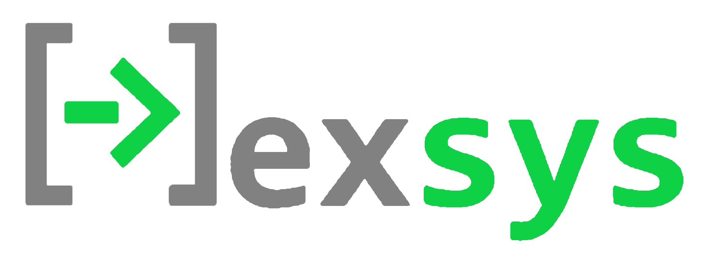

# Ngineer
Ngineer is a collection of miscellaneous tools for modelling and solving a wide range of engineering problems.

## Tools:

### Gmatlib - Simple Matrix Algebra in Rust
`gmatlib` is a rust crate that defines a simple `Matrix<T>` type for simplifying matrix/vector-math intensive rust code. 

### Geqslib - Simple Equation and System Solving in Rust
`geqslib` is a rust crate that offers simple functions for evaluating math expressions as strings, finding roots of numerical functions, and solving 1 or more equations simultaneously.

### Nexsys - Solve Systems Equations in Plaintext Format

`nexsys` is an executable rust crate for solving systems of equations in text files (sort of like a runtime/compiler). It returns solutions in JSON-like format for easy deserialization and use elsewhere

### Neapolitan - Easily Develop and Model Circuit-like problems
`neapolitan` is a rust crate and framework for modelling problems similar to circuits, such as hydraulics, heat-transfer problems, and certain electromagnetic problems. It offers a simple framework for extending the problems it can solve, allowing users to tap into it's simple modelling process to solve complex problems.